# Cortex — A Production-Inspired Admin User Management System

Cortex is a **full-stack, admin-driven user management application** built to reflect how real internal dashboards are designed: secure authentication, middleware pipelines, controlled file uploads, instant feedback, and predictable UI behavior under real conditions.

It focuses on **clarity, stability, and correctness** — going beyond basic CRUD — with careful attention to how backend structure and frontend UX integrate in a real-world conditions.

---

## 🎯 What Cortex Solves

* Secure admin-only access with session handling
* Instant UI feedback without full reloads
* Hybrid rendering (server + AJAX)
* Reliable error delivery across redirects
* Image upload pipelines with validation & transformation
* UX safety (loading locks, previews, inline errors)
* Scalable middleware design

> The goal was to build an admin system that behaves correctly even when things go wrong — slow requests, bad uploads, validation errors, or repeated actions.

---

## 🔗 Live Demo

* [https://cortex-eij0.onrender.com](https://cortex-eij0.onrender.com)

---

## 🖼️ Screenshots

### 🔐 Login (Admin & User)

**Secure authentication with real-time inline validation and feedback**


### 📝 Registration (Admin & User)

**Unified registration flow with role-aware logic, real-time inline validation , image validation,  toast and feedback**

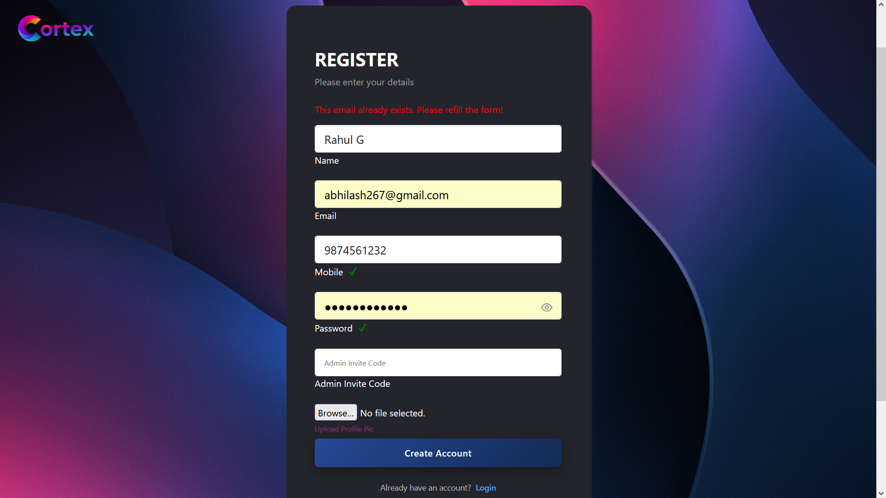
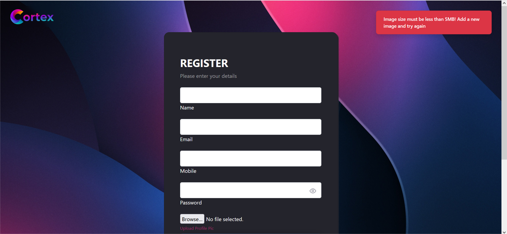

### 📊 Admin Dashboard

**Sortable, searchable, AJAX-powered user table with clear visual state**

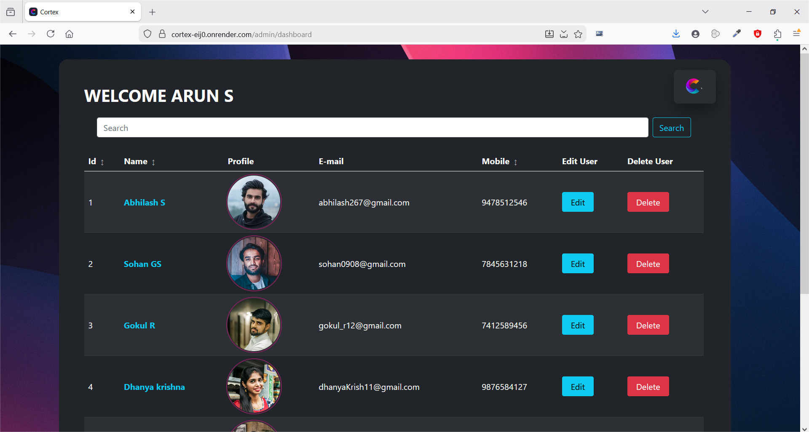
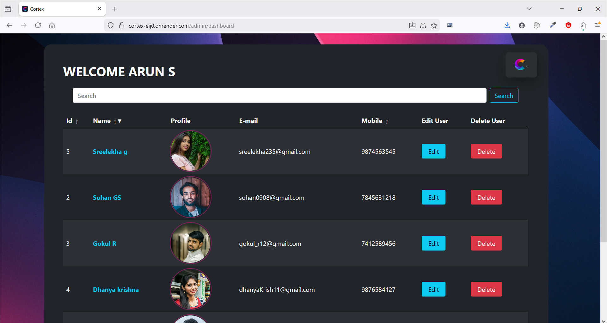

---

### ➕ Add / Edit User

**Live validation, image preview, upload protection & loading states**

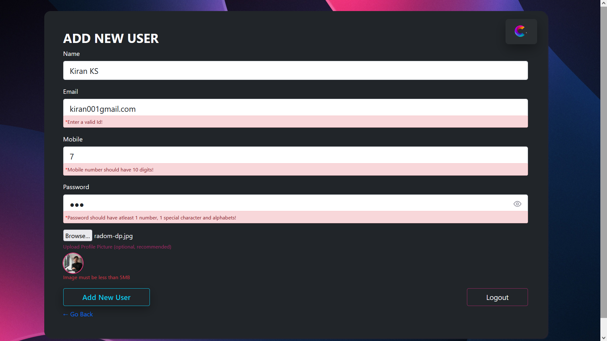
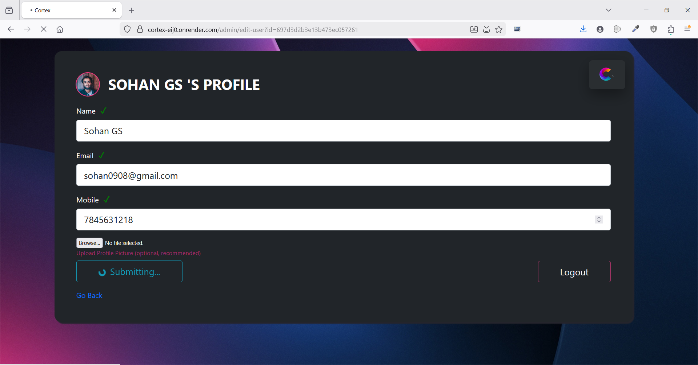

---

### 🔍 Search & Delete with toast (AJAX)

**No page reloads, instant feedback, toast, safe UX**

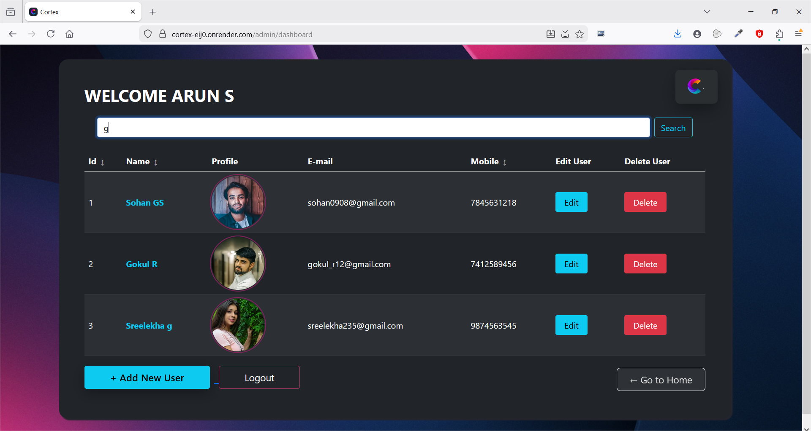
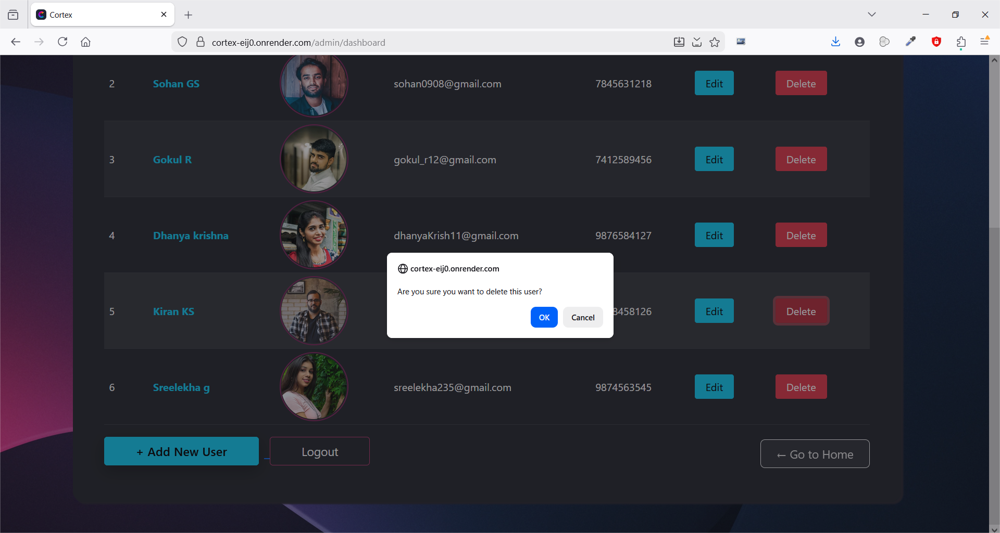
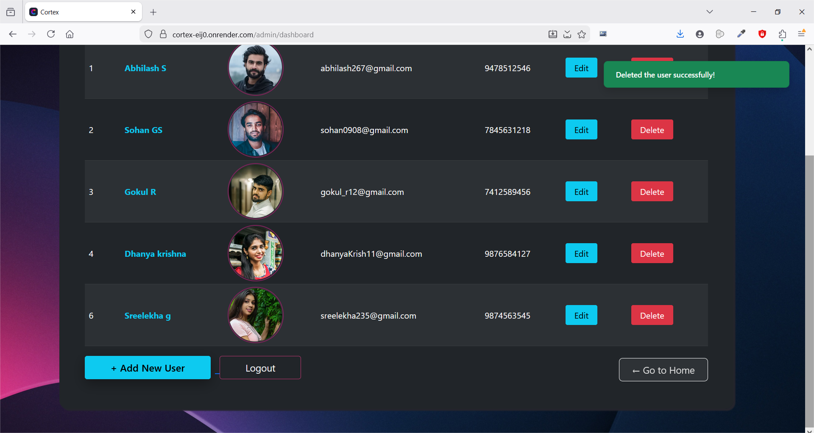

---

### 🚫 404 — Page Not Found and 500 — Something Went Wrong

**Graceful handling of invalid routes with a user-friendly fallback**

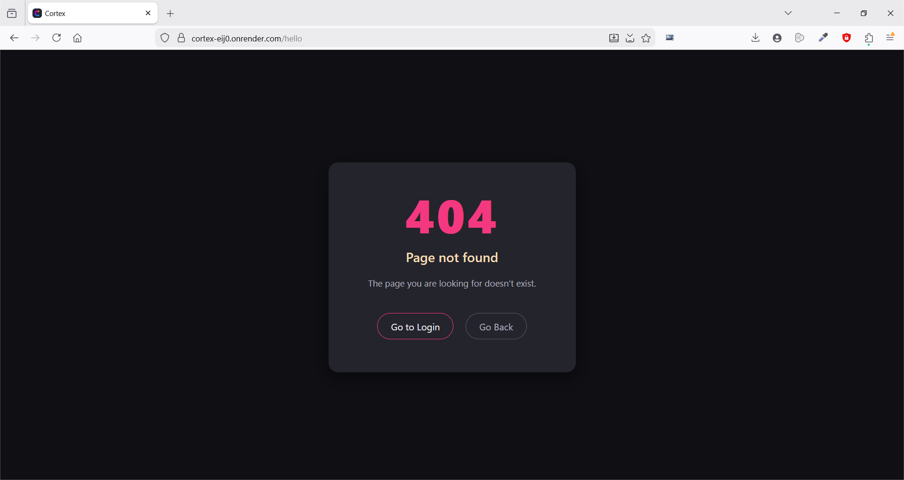

---

### 🪩 Toast (Example used- user's home page)

**Custom-built feedback system (success, error,)**

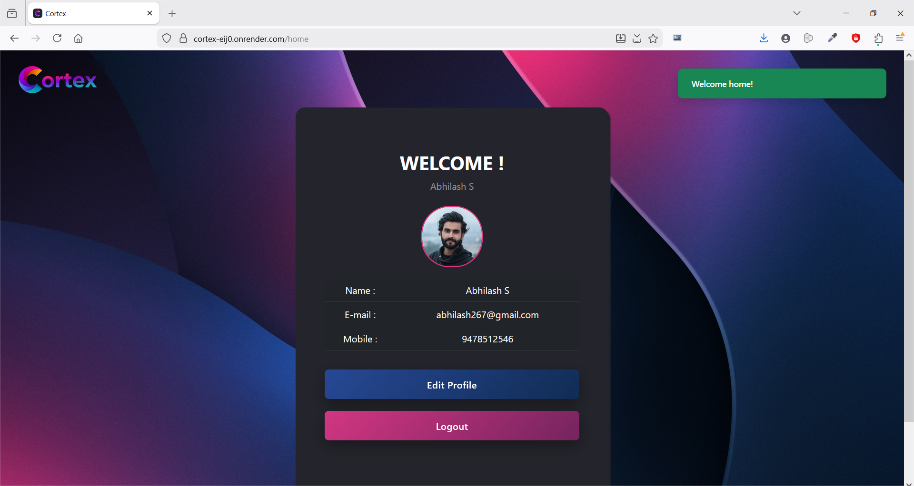

---

## ✨Features

### 🔐 Admin Authentication & Route Protection

* Session-based login (Express Session)
* Role-protected routes via `adminAuth` middleware
* Prevents unauthorized URL access
* No-cache headers for sensitive pages

**Result:** secure admin-only system with predictable access control.

..................................................................................................

### ⚡ Hybrid Rendering (Server + AJAX)

Cortex intentionally mixes **server rendering (EJS)** with  **AJAX interactions** :

* Page loads → server rendered
* Search & delete → AJAX (instant UX)
* Errors → toast or inline feedback
* Redirects → still show messages via session

..................................................................................................

### 🔍 Live Search (AJAX)

* No reload
* Debounced user search
* Instant DOM updates
* Backend still controls logic

..................................................................................................

### 🗑️ Delete User (AJAX)

* No reload
* Toast feedback
* Safe error handling
* Backend still controls logic

..................................................................................................

### 🪩 Custom Toast System (Built From Scratch)

Cortex uses a  **custom toast pipeline** , not a library:

* Works across redirects
* Auto-dismiss
* Success / error
* Used for all critical actions

..................................................................................................

### 📝 Form Validation System

##### Frontend

* Live inline validation
* Prevents invalid submit
* Clear error messages
* Image size validation

##### Backend

* Final validation layer
* Errors injected as toast

**Result:** safe, user-friendly forms without silent failures.

..................................................................................................

### 🔐 Authentication & Role-Based Access

**Unified registration flow with role separation and controlled access**

* Supports **User and Admin registration**
* Admin registration is protected via a **secure admin invite code**
* Prevents unauthorized privilege escalation
* Clean separation of concerns between user and admin roles from the first interaction

..................................................................................................

### 👤 Profiles & Account Management

**Dedicated profile pages for both users and admins**

* Each user and admin has an individual **profile page**
* Profile details can be **edited and updated securely**
* Supports profile image updates with validation and preview
* Updates provide immediate UI feedback via toast notifications

..................................................................................................

### 🖼️ Image Upload Pipeline

Cortex uses a  **dedicated upload middleware** :

1. Multer intercepts file
2. Cloudinary upload
3. Face-focused cropping
4. Dimension enforcement
5. Size validation
6. Permanent storage
7. Error returned as toast

**Why this matters:**
So as to handle uploads like production systems

..................................................................................................

### 👁️ Image Preview & Upload Protection

* Live preview before submit
* Blocks oversized images
* Reduces server load
* Prevents user frustration

..................................................................................................

### ⏳ Submit Loading Lock

All forms use a  **loading lock system** :

* Spinner on submit
* Button disabled
* Prevents double submissions
* Consistent UX across app

..................................................................................................

### 🔁 Sorting System (Dashboard)

##### Client-side sorting by:

* ID, name, email, phone number

Features:

* Asc/desc toggle
* Visual arrows
* Stable header row
* No DOM corruption

..................................................................................................

### 📱 Responsive & Very minimal & to the point lightweight UI

Designed to stay readable and usable across all screen sizes.

..................................................................................................

### 🧩 Middleware Architecture

Cortex uses  **focused, reusable middlewares** :

| Middleware    | Purpose                        |
| ------------- | ------------------------------ |
| adminAuth     | Protect admin routes           |
| auth          | User access control            |
| imageUploader | Centralized image pipeline     |
| nocache       | Prevent sensitive page caching |

This keeps controllers clean and logic isolated.

..................................................................................................

### 🧱 EJS Partial System

Reusable layout components:

* `head.ejs` → dynamic CSS injection
* `footer.ejs` → dynamic JS injection
* `logo.ejs` → shared branding

Pages can:

* Enable/disable Bootstrap
* Add page-specific scripts
* Add page-specific styles

..................................................................................................

### 🎨 CSS Architecture

Separated by concern:

* `global.css`
* `dashboard.css`
* `toast.css`
* `login.css`
* `errors.css`

No CSS bloat. No conflicts.

..................................................................................................

### 🚨 Error Handling

* Custom **404 page**
* Custom **500 page**
* Backend errors shown via toast
* Upload errors handled gracefully
* No raw stack traces leaked

..................................................................................................

## 🛠 Tech Stack

### Frontend

* HTML
* EJS
* CSS
* Bootstrap
* Vanilla JavaScript
* AJAX

### Backend

* Node.js
* Express.js
* MongoDB
* Mongoose
* Multer
* Cloudinary
* Express Session

### Deployment

* Render

---

## 🧪 Engineering Focus

Cortex intentionally focuses on  **real admin system problems** :

* Session-based UX feedback
* Redirect-safe messaging
* File upload safety
* Middleware separation
* Hybrid rendering strategy
* Instant admin actions (AJAX)
* Predictable loading states
* No accidental double submits
* Clean MVC boundaries
* Clear failure states

> The goal was to build something that behaves (or atleast close to) like internal tools used in companies — stable, predictable, and safe.

---

## ⚙️ Local Setup

```bash
git clone https://github.com/arun-s3/Cortex
npm install
npm devStart
```

### `.env`

```
MONGO_URI = your_mongo_uri
PORT = your_port
ADMIN_INVITE_CODE= your_invite_code
CLOUDINARY_CLOUD_NAME=...
CLOUDINARY_API_KEY=...
CLOUDINARY_API_SECRET=...
```

---

## 📄 License

MIT

---
